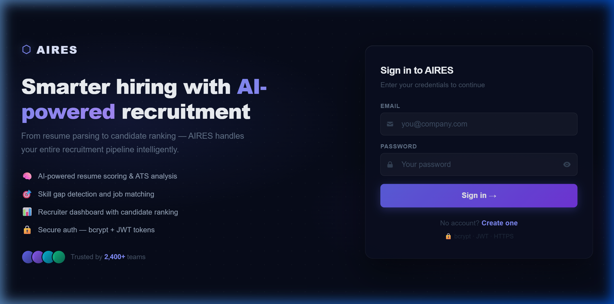
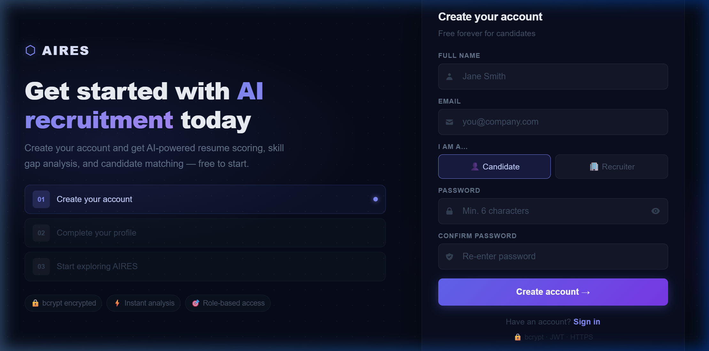
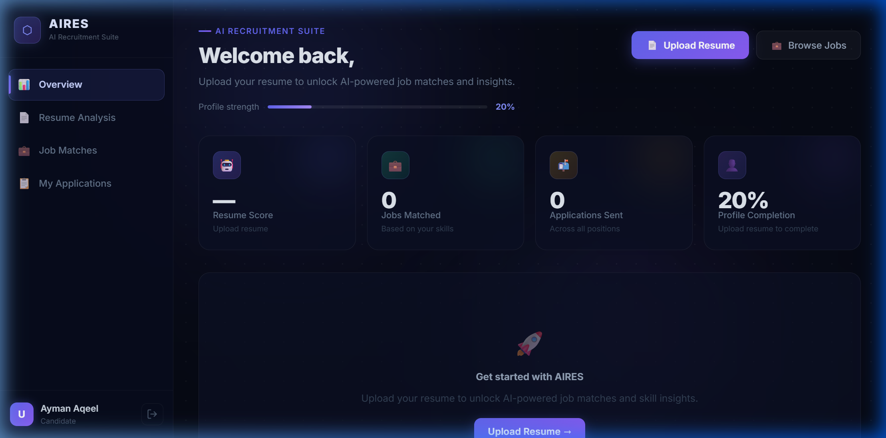
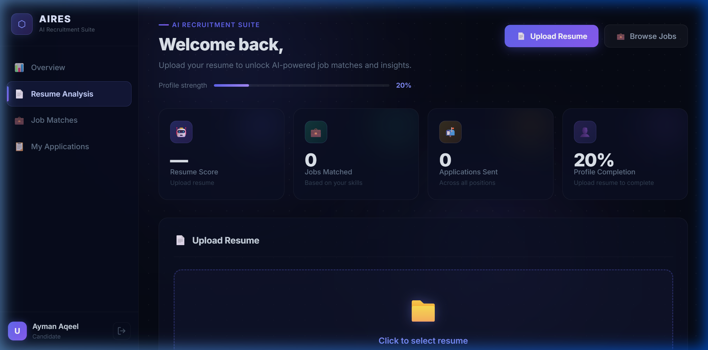

<div align="center">

# AIRES — AI Resume Analyzer & Job Match System

**A full-stack AI-powered recruitment platform built with the MERN stack**

[](https://react.dev)
[](https://nodejs.org)
[](https://www.mongodb.com/atlas)
[](https://vitejs.dev)
[](#license)

</div>

---

## Project Overview

**AIRES** (AI Resume Analyzer & Job Match System) is a full-stack Applicant Tracking System (ATS) that automates the recruitment pipeline for both job seekers and recruiters.

Traditional hiring processes are slow, inconsistent, and rely on manual resume screening. AIRES solves this by combining **AI-powered resume parsing**, **intelligent skill-based job matching**, and a **structured applicant tracking workflow** — giving candidates actionable career insights and giving recruiters a ranked, data-driven shortlisting tool.

> Built as a portfolio project demonstrating full-stack development, AI integration, and modern SaaS UI design.

---

## Key Features

### 👤 Candidate Side
- **Secure Registration & Login** — Role-based authentication with bcrypt + JWT
- **Resume Upload & AI Parsing** — Upload PDF/DOCX; AI extracts skills, education, and experience
- **Job Match Scoring** — Each job listing is scored against the candidate's profile (0–100%)
- **Skill Gap Analysis** — Instantly see which skills you need to develop for a target role
- **One-Click Apply** — Apply to jobs and track status in real time
- **Application Dashboard** — Monitor all applications with live status updates

### 🏢 Recruiter Side
- **Job Post Management** — Create, edit, and delete job listings with required skills
- **AI-Ranked Candidate List** — Applicants sorted by match score for each position
- **Status Management** — Move candidates through Applied → Shortlisted → Rejected
- **Analytics Dashboard** — Pipeline metrics, application funnel chart, shortlist rate, and average match score

### ⚙️ Platform
- **Glassmorphism SaaS UI** — Premium dark-themed design with animated gradients and glass cards
- **Protected Routes** — Role-based routing enforced on client and server
- **MongoDB Cloud Storage** — Persistent data via MongoDB Atlas
- **Responsive Layout** — Works across desktop and tablet viewports

---

## Screenshots

| | |
|:---:|:---:|
|  |  |
| **Login Page** | **Register Page** |
|  |  |
| **Candidate Dashboard** | **Resume Analysis** |

> Place screenshots in a `screenshots/` folder in the repository root.

---

## Tech Stack

### Frontend
| Technology | Purpose |
|---|---|
| **React 18** | Component-based UI framework |
| **Vite 5** | Lightning-fast dev server & build tool |
| **Tailwind CSS** | Utility-first styling |
| **React Router v6** | Client-side routing & protected routes |

### Backend
| Technology | Purpose |
|---|---|
| **Node.js 18** | JavaScript runtime |
| **Express.js** | REST API framework |
| **Mongoose** | MongoDB ODM |

### Database
| Technology | Purpose |
|---|---|
| **MongoDB Atlas** | Cloud-hosted NoSQL database |

### Security
| Technology | Purpose |
|---|---|
| **bcrypt** | Password hashing |
| **JSON Web Tokens (JWT)** | Stateless authentication |
| **dotenv** | Secure environment variable management |

---

## Project Architecture

```
┌─────────────────────────────────────────────────┐
│              CLIENT (React + Vite)               │
│                                                 │
│  Login/Register ──► Candidate Dashboard         │
│                 └──► Recruiter Dashboard        │
│                                                 │
│  • Role-based protected routes                  │
│  • localStorage session (dev) / JWT (prod)      │
└───────────────────────┬─────────────────────────┘
                        │  HTTP REST API
                        ▼
┌─────────────────────────────────────────────────┐
│         BACKEND API (Node.js + Express)          │
│                                                 │
│  POST /api/auth/register                        │
│  POST /api/auth/login                           │
│  GET  /api/jobs                                 │
│  POST /api/jobs                                 │
│  GET  /api/applications                         │
│  PATCH /api/applications/:id/status             │
│                                                 │
│  • JWT middleware on protected routes           │
│  • Role guard (candidate / recruiter)           │
└───────────────────────┬─────────────────────────┘
                        │  Mongoose ODM
                        ▼
┌─────────────────────────────────────────────────┐
│              MongoDB Atlas (Cloud)               │
│                                                 │
│  Collections: users, jobs, applications         │
│  • Encrypted connection string via .env          │
│  • IP whitelist on Atlas cluster                │
└─────────────────────────────────────────────────┘
```

**Authentication Flow:**
1. Client sends credentials → `POST /api/auth/login`
2. Server verifies password with bcrypt, returns signed JWT
3. Client stores JWT, attaches it as `Authorization: Bearer <token>` on subsequent requests
4. Server middleware validates token on every protected route

---

## Folder Structure

```
AIRES/
├── src/                          # React frontend source
│   ├── components/
│   │   ├── Login.jsx
│   │   ├── Register.jsx
│   │   ├── CandidateDashboard.jsx
│   │   ├── RecruiterDashboard.jsx
│   │   ├── ResumeUpload.jsx
│   │   ├── ResumeInsights.jsx
│   │   ├── JobList.jsx
│   │   ├── JobPost.jsx
│   │   ├── CandidateRanking.jsx
│   │   ├── Analytics.jsx
│   │   ├── DashboardLayout.jsx
│   │   ├── MetricCard.jsx
│   │   ├── auth.css
│   │   └── dashboard.css
│   ├── App.jsx
│   ├── App.css
│   └── index.css
├── server/                       # Node.js + Express backend
│   ├── src/
│   │   ├── config/
│   │   │   └── db.js             # MongoDB connection
│   │   ├── models/               # Mongoose schemas
│   │   ├── routes/               # Express route handlers
│   │   └── index.js              # Server entry point
│   ├── .env                      # Environment variables (not committed)
│   └── package.json
├── screenshots/                  # README screenshots
├── .gitignore
├── index.html
├── vite.config.js
├── package.json
└── README.md
```

---

## Installation Guide

### Prerequisites
- Node.js v18 or higher
- npm v9 or higher
- A free [MongoDB Atlas](https://www.mongodb.com/atlas) account

### 1. Clone the repository

```bash
git clone https://github.com/your-username/AIRES.git
cd AIRES
```

### 2. Install frontend dependencies

```bash
npm install
```

### 3. Install backend dependencies

```bash
cd server
npm install
cd ..
```

### 4. Configure environment variables

Create a `.env` file inside the `server/` directory (see [Environment Variables](#environment-variables) below).

### 5. Run the application

**Start the backend** (from `server/` directory):
```bash
cd server
node src/index.js
```

**Start the frontend** (from project root, in a new terminal):
```bash
npm run dev
```

Open [http://localhost:5173](http://localhost:5173) in your browser.

---

## Environment Variables

Create `server/.env` with the following variables:

```env
# MongoDB Connection
MONGO_URI=mongodb+srv://<username>:<password>@cluster0.xxxxx.mongodb.net/aires?retryWrites=true&w=majority

# JWT Configuration
JWT_SECRET=your_super_secret_jwt_key_here
JWT_EXPIRES_IN=7d

# Server
PORT=5000
NODE_ENV=development
```

> ⚠️ **Never commit your `.env` file.** It is already included in `.gitignore`.

---

## Security Practices

| Practice | Implementation |
|---|---|
| **Password hashing** | All passwords are hashed with `bcrypt` (salt rounds: 12) before storage |
| **JWT authentication** | Stateless auth tokens signed with a secret key; expire after 7 days |
| **Protected routes** | All API endpoints (except `/auth`) require a valid JWT via middleware |
| **Role-based access control** | Candidates and recruiters see different dashboards; server enforces role on each route |
| **Secure database access** | MongoDB URI stored in `.env`; Atlas cluster uses IP whitelisting |
| **Environment variables** | No secrets are hardcoded — all loaded via `dotenv` |
| **Input validation** | Server validates all incoming request bodies before processing |

---

## Future Improvements

- [ ] **NLP-based resume parsing** — Replace simulated parsing with a real SpaCy or OpenAI-powered pipeline for accurate skill extraction from arbitrary resume layouts
- [ ] **AI resume scoring** — Generate a holistic ATS compatibility score benchmarked against similar applicant pools
- [ ] **Semantic job matching** — Use vector embeddings (e.g., `sentence-transformers`) for synonym-aware matching (e.g., "JS" → "JavaScript")
- [ ] **Weighted skill importance** — Allow recruiters to mark skills as mandatory vs. preferred; reflect weight in match score
- [ ] **Email notifications** — Notify candidates when their application status changes
- [ ] **Interview scheduling** — Integrate with Google Calendar API to book and confirm interview slots in-app
- [ ] **Resume improvement suggestions** — AI-generated, role-specific tips to improve a candidate's resume
- [ ] **Job recommendation engine** — Proactively surface relevant jobs to candidates without them searching
- [ ] **Mobile app** — React Native companion app with push notifications

---

## Author

**Ayman Aqeel**

A passionate developer focused on building impactful, production-quality software at the intersection of:

- 🖥️ **Full Stack Development** — MERN stack, REST APIs, SaaS UI design
- 🔐 **Cybersecurity** — Secure authentication, JWT, bcrypt, protected architectures
- 🤖 **AI-Based Applications** — NLP, resume intelligence, intelligent matching systems

---

## License

This project is developed for **educational and portfolio purposes**.

You are free to:
- ✅ Use this project as a reference or learning resource
- ✅ Fork and modify it for your own portfolio

Please **credit the original author** if you build upon this work.

---

<div align="center">

Made with ❤️ by **Ayman Aqeel**

</div>
